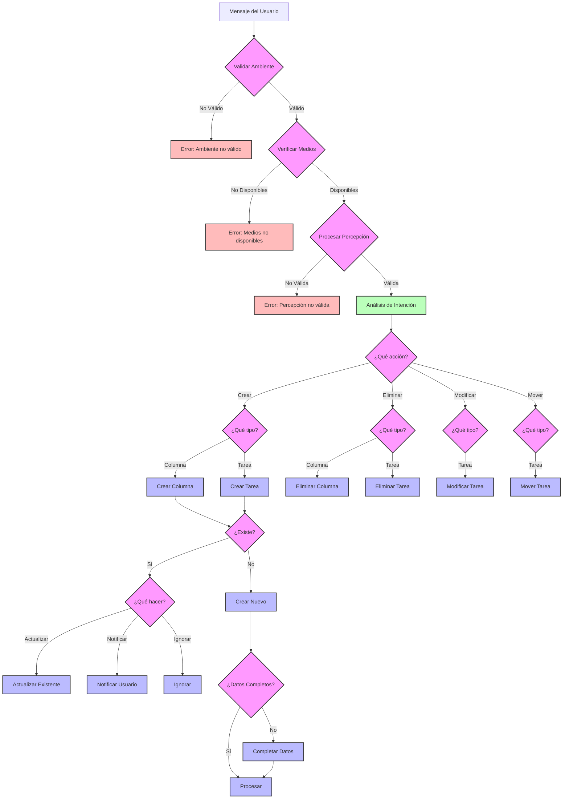

# Árbol de Decisión del Sistema Experto

## Explicación del Árbol de Decisión

### 1. Nodos de Decisión (Rosa)
- **Validar Ambiente**: Verifica si el entorno es adecuado
- **Verificar Medios**: Comprueba disponibilidad de recursos
- **Procesar Percepción**: Analiza el mensaje
- **¿Qué acción?**: Determina el tipo de acción
- **¿Qué tipo?**: Identifica si es tarea o columna
- **¿Existe?**: Verifica existencia del elemento
- **¿Qué hacer?**: Decide manejo de elementos existentes
- **¿Datos Completos?**: Verifica información necesaria

### 2. Nodos de Acción (Azul)
- **Crear Columna/Tarea**: Crea nuevos elementos
- **Eliminar Columna/Tarea**: Elimina elementos
- **Modificar Tarea**: Actualiza tareas
- **Mover Tarea**: Cambia ubicación
- **Actualizar Existente**: Modifica elementos
- **Notificar Usuario**: Informa resultados
- **Ignorar**: No realiza acción
- **Completar Datos**: Agrega información
- **Procesar**: Ejecuta acción

### 3. Nodos de Error (Rojo)
- **Error de Ambiente**: Problemas con entorno
- **Error de Medios**: Falta de recursos
- **Error de Percepción**: Problemas de procesamiento

### 4. Nodos de Proceso (Verde)
- **Análisis de Intención**: Procesa el mensaje

## Flujo de Decisión

1. El sistema recibe un mensaje del usuario
2. Valida el ambiente y los medios disponibles
3. Procesa la percepción del mensaje
4. Analiza la intención del usuario
5. Determina la acción y el tipo de elemento
6. Verifica la existencia del elemento
7. Decide cómo manejar el elemento
8. Valida y completa los datos necesarios
9. Ejecuta la acción correspondiente

## Consideraciones

- Cada decisión incluye validaciones necesarias
- El sistema maneja errores en cada paso
- Las acciones se ejecutan en orden de prioridad
- El árbol permite diferentes caminos de decisión
- Se pueden agregar nuevas ramas según sea necesario 